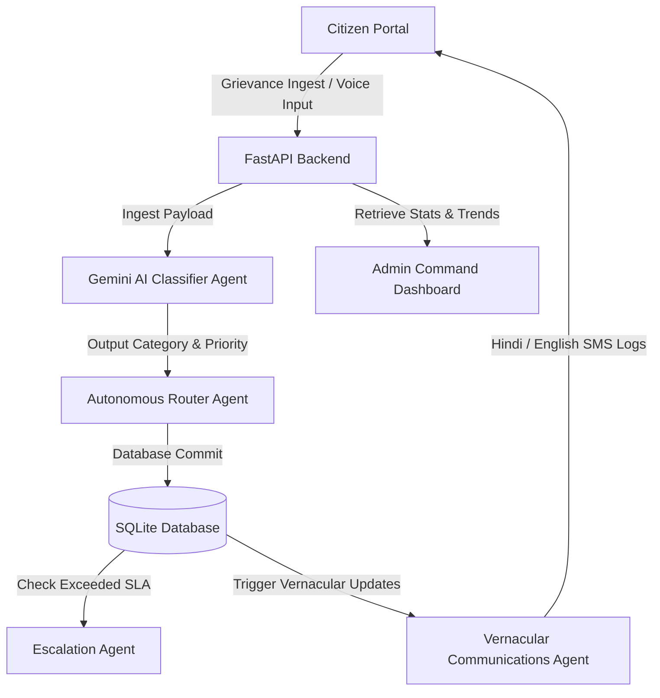

# 🏛️ Jansathi AI

> **AI-Powered Grievance Resolution Assistant for Smarter Governance.**
> Built for the Smart Governance Hackathon.

---

## 🇮🇳 Project Overview

**Team Name:** Team Boolean  
**Project:** Jansathi AI  
**Team Members:** Neeraj · Rounak · Vinay · Sreedharan

---

### The Problem

Government grievance portals like Uttar Pradesh's *Jansunwai* receive millions of complaints annually. Resolution is slow due to manual triaging, poor department routing, lack of transparency, and limited citizen communication — especially in vernacular languages.

### Our Solution

**Jansathi AI** is an agentic, end-to-end grievance processing suite. It leverages generative AI (Google Gemini) to instantly ingest, classify, prioritize, route, summarize, translate, and autonomously escalate public complaints — keeping both citizens and administrators informed at every step.

---

## ✨ Key Features

| Feature | Description |
|---|---|
| 🤖 **AI Grievance Ingestion** | Detects intent, extracts keywords, estimates category & sentiment |
| 🎙️ **Speech-to-Text Dictation** | Native voice input in Hindi and English for accessibility |
| 📬 **Automated Intelligent Routing** | Auto-assigns complaints to departments (PWD, UPPCL, Sanitation, etc.) with SLA priorities |
| ⏱️ **Autonomous SLA Escalation Engine** | Scheduler daemon that escalates unresolved tickets to the DM/Commissioner when SLAs are breached |
| 📲 **Vernacular SMS Updates** | Bilingual (Hindi + English) citizen notifications in conversational language |
| 📊 **Command Analytics Dashboard** | Admin oversight portal with SVG trend charts, workload distribution, and resolution stats |

---

## 🛠️ Tech Stack

- **Frontend:** React (Vite) + Tailwind CSS + Lucide Icons
- **Backend:** FastAPI (Python)
- **Database:** SQLite (SQLAlchemy ORM)
- **AI Agent Core:** Google Gemini API (`gemini-1.5-flash`)
- **Developer Tools:** `python-dotenv`, `uvicorn`, `npm`

---

## ⚙️ Architecture



---

## 🚀 Setup & Installation

### Prerequisites
- Node.js v18+
- Python v3.10+

---

### 1. Backend Setup

```bash
cd backend
```

Create and activate a virtual environment:

```bash
# Windows
python -m venv venv
venv\Scripts\activate

# macOS / Linux
python3 -m venv venv
source venv/bin/activate
```

Install dependencies:

```bash
pip install -r requirements.txt
```

 Add your Gemini API key — create a `.env` file inside the `backend/` folder:

```env
GEMINI_API_KEY=your_gemini_api_key_here
```

> 💡 **No API key? No problem.** Jansathi AI automatically activates a **local keyword-based heuristic fallback**, keeping classification, priority detection, and routing fully operational for offline testing.

Start the backend server:

```bash
python main.py
```

The API will be available at `http://127.0.0.1:8000`.

---

### 2. Frontend Setup

Open a new terminal window:

```bash
cd frontend
npm install
npm run dev
```

The web dashboard will be available at `http://localhost:5173`.

---

## 🎥 Demo Walkthrough (2 Minutes)

1. **Ingestion** — A citizen dictates a complaint in Hindi using the speech-to-text button:
   > *"Sector 4 ke main crossing road par bade bade gaddhe ho gaye hain, do-wheeler gir rahe hain."*

2. **AI Analysis** — Click **"File Official Grievance"**. Within 1 second:
   - Category: **Roads**
   - Department: **Public Works Department (PWD)**
   - Priority: **High** *(accident safety risk)*
   - Tracking ID: `TKT-XXXXXX`

3. **Citizen Notification** — A vernacular SMS log is recorded:
   - 🇬🇧 *"Your complaint has been assigned to Public Works Department..."*
   - 🇮🇳 *"आपकी शिकायत Public Works Department को सौंप दी गई है।"*

4. **Admin SLA Escalation** — Switch to the **Admin Panel** and click **"Simulate 48h SLA Tick"**:
   - The system ages all tickets.
   - High-priority tickets older than 3 days are **automatically escalated** to the District Commissioner.
   - Bilingual warning notifications are sent to the citizen.

5. **Resolution** — The PWD admin updates the ticket:
   > *"Repaired road crossing potholes. Inspector verified."*
   
   Status is marked **Resolved** ✅

---

## 🔮 Future Roadmap

- **OCR Image Analysis** — Scan uploaded grievance photos to automatically verify repair work
- **WhatsApp Bot Integration** — File and track complaints via interactive WhatsApp dialogue
- **Duplicate Detection** — Use vector databases to group similar complaints from multiple citizens
- **District Heatmaps** — Geotagged density maps of civic issues to assist district budget planning

---

## 📄 License

This project was built for the Build with AI: Agentic Premier League Hackathon. See `LICENSE` for details.
