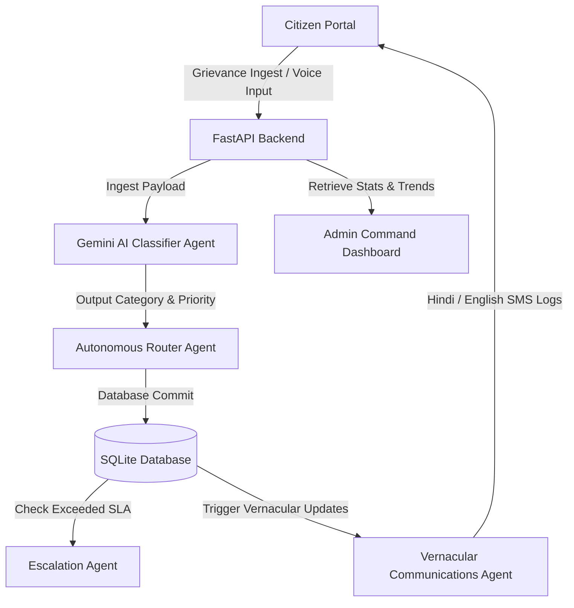

<<<<<<< HEAD
# Jansathi AI

> **AI-Powered Grievance Resolution Assistant for Smarter Governance.**
> Built for the Smart Governance Hackathon.

---

## 🇮🇳 Project Overview

**Team Name:** Team Jansathi
**Problem Statement:** Uttar Pradesh's *Jansunwai* portal receives millions of public complaints annually. However, processing times are slow, manual categorisation is error-prone, tracking is opaque, and citizens lack real-time vernacular communication regarding their ticket status.

**Solution:** **Jansathi AI** is an agentic, end-to-end grievance processing suite. It leverages generative AI (Google Gemini) to instantly ingest, classify, prioritize, route, summarize, translate, and autonomously escalate public complaints.

---

## ✨ Key Features

1. **AI Grievance Ingestion**: Detects intent, maps complaints, extracts keywords, and estimates category/sentiment.
2. **Speech-to-Text Dictation**: Native integration of voice typing in both Hindi and English for accessibility.
3. **Automated Intelligent Routing**: Automatically assigns complaints to departments (e.g., PWD, UPPCL, Sanitation) with detailed SLA priorities.
4. **Autonomous SLA Escalation Engine**: An active scheduler daemon that escalates complaints to higher authorities (e.g., District Magistrate/Commissioner) if resolution timelines are breached.
5. **Vernacular SMS Updates**: Automatically translates and updates citizens with clear, conversational Hindi and English SMS notifications.
6. **Command Analytics Dashboard**: A single oversight portal for administrative desks featuring SVG trends, workload distribution, and resolution stats.

---

## 🛠️ Tech Stack

- **Frontend**: React (Vite) + Tailwind CSS + Lucide Icons
- **Backend**: FastAPI (Python)
- **Database**: SQLite (SQLAlchemy ORM)
- **AI Agent Core**: Google Gemini API (`gemini-1.5-flash`)
- **Developer Tools**: `python-dotenv`, `uvicorn`, `npm`

---

## ⚙️ Architecture



---

## 🚀 Setup & Installation Instructions

Follow these steps to run both the frontend and backend servers locally on your machine.

### Prerequisites
- Node.js (v18+)
- Python (v3.10+)

### 1. Backend Setup
Navigate to the `backend/` directory:
```bash
cd backend
```
Create a virtual environment and activate it:
```bash
# Windows
python -m venv venv
venv\Scripts\activate

# macOS / Linux
python3 -m venv venv
source venv/bin/activate
```
Install dependencies:
```bash
pip install -r requirements.txt
```
*(Optional)* Add your Gemini API Key. Create a `.env` file inside the `backend` folder:
```env
GEMINI_API_KEY=your_gemini_api_key_here
```
> **Note:** If no API key is provided, Jansathi AI automatically activates a **local keyword-based heuristic fallback**, ensuring that classification, priority detection, and routing remain 100% operational for offline testing!

Start the backend server:
```bash
python main.py
```
The backend API will run at `http://127.0.0.1:8000`.

---

### 2. Frontend Setup
Navigate to the `frontend/` directory in a new terminal window:
```bash
cd frontend
```
Install dependencies:
```bash
npm install
```
Start the development server:
```bash
npm run dev
```
The web dashboard will run at `http://localhost:5173`.

---

## 🎥 Demo Walkthrough Scenario (2 Minutes)

1. **Ingestion**: A citizen logs on and dictates a complaint in Hindi using the speech-to-text button: *"Sector 4 ke main crossing road par bade bade gaddhe ho gaye hain, do-wheeler gir rahe hain."*
2. **AI Analysis**: Click **"File Official Grievance"**. Within 1 second:
   - Category is classified under **Roads**.
   - Routed automatically to the **Public Works Department (PWD)**.
   - Priority is detected as **High** (accident safety risk).
   - Generates a tracking ID (`TKT-XXXXXX`).
3. **Citizen Notification**: A vernacular SMS log is recorded:
   - English: *"Your complaint has been assigned to Public Works Department..."*
   - Hindi Devanagari: *"आपकी शिकायत Public Works Department को सौंप दी गई है।"*
4. **Admin Escalation Tick**: Switch to **Admin Panel**. Click **"Simulate 48h SLA Tick"**.
   - The system ages tickets.
   - High-priority tickets older than 3 days are **automatically escalated** to the District Commissioner desk.
   - Generates bilingual warning updates for the citizen.
5. **Resolution**: The PWD admin manages the ticket, enters action details: *"Repaired road crossing potholes. Inspector verified."*, and marks it as **Resolved**.

---

## 🔮 Future Roadmap

- **OCR Image Analysis**: Scan uploaded grievance photos to verify repair work authenticity automatically.
- **WhatsApp Bot Integration**: File and track complaints via interactive WhatsApp dialogue.
- **Duplicate Detection**: Use vector databases to identify if another citizen has already filed a complaint about the same issue, grouping them together.
- **District heatmaps**: Geotagging coordinates to show visual density maps of civic issues for district budgeting.
=======
## Problem Statement

Government grievance portals like Jansunwai receive massive volumes of complaints, but resolution is often delayed due to manual triaging, poor routing, lack of transparency, and limited citizen communication.

Our solution, Jansathi AI, is an autonomous grievance-resolution agent that classifies complaints using AI, routes them to the appropriate department, performs automated follow-ups and escalations, and provides citizens with real-time vernacular status updates.****

# Team Team Boolean

## Project
Jansathi AI

## Tech Stack
React, Node.js, Gemini API

## Team Members
- Neeraj
- Rounak
- Vinay
- Sreedharan
>>>>>>> d5662c83b6cc3f58023409dc55897d1f5891ea5d
